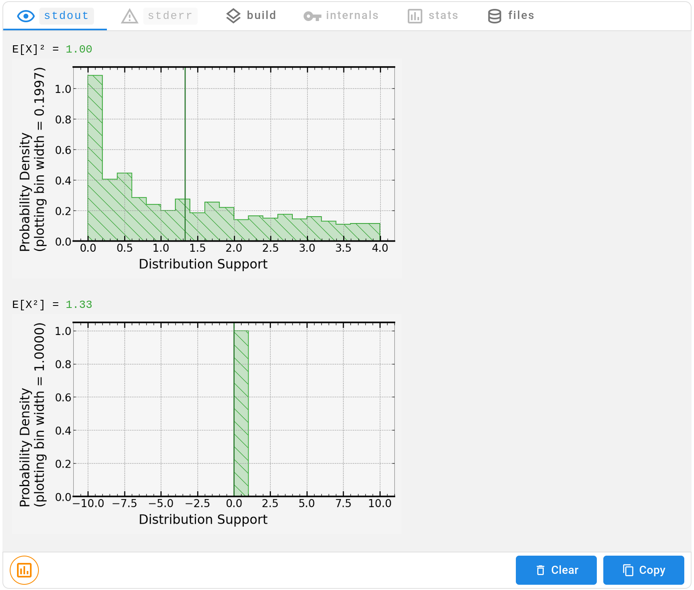

[](https://signaloid.io/repositories?connect=https://github.com/signaloid/Signaloid-Demo-General-ComputingWithDistributions#gh-dark-mode-only)
[](https://signaloid.io/repositories?connect=https://github.com/signaloid/Signaloid-Demo-General-ComputingWithDistributions#gh-light-mode-only)


# Computing with Distributions

Let us look at an example that demonstrates how the result of a computation using
Signaloid's processor can be more accurate than traditional computers.

We try to find the simplest possible example: a single arithmetic operation on one variable.
We are going to compute `X²` where `X` is either a single value or a random
variable with a probability distribution.

We use a probability distribution when we don't know the precise value of `X` but we know which value `X` can likely take.
In practice, the uncertainty of `X` may stem from imprecise measurement or simply because we are making estimations and we don't have access to `X`.

## Abstract View

Let `X` be a random variable with an uniform distribution in the interval `[0,2]`.

A normal processor, which does not support distributions, needs to pick a value for `X`.
A natural choice is the mean, or expected value, of `X`.
In technical terms, the expected value of `X` is written `E[X]`.
The mean value of an uniform distribution in the interval `[0,2]` is `1`.
Instead, the Signaloid processor keeps the whole distribution for `X`.

If we compute `X²` with and without the distribution, we get different results.
* A normal processor computes `E[X]²` and returns `1.00`.
* Signaloid processor computes `E[X²]` and returns `1.33`.

Already, in such a simple computation we see a difference larger than 30% between a normal computation and a computation with the distribution.

The code producing this result is:
```c
double x = uniformDistribution(0, 2);
double x2 = x * x;
printf("E[X]² = %.2lf\n", x2);
printf("E[X²] = %.2lf\n", libUncertainDoubleNthMoment(x2, 1));
```
Check the [main.c](src/main.c) for a detailed explanation of what each line does.

To run this yourself, click on the "Add to signaloid.io" button at the beginning of the `README.md`[^0].

### Interpreting the Program's Output

Running this program on [signaloid.io](https://signaloid.io/) produces the following output:


Notice that the numbers are displayed in green with a plot icon next to them.
For these numbers, we can display a plot of the associated distribution.
To show the plot, you can:
1. Move your mouse over a particular number,
2. Click the bottom left button to show all the plots.

Clicking on the button shows



The first plot shows the distribution of `X²`.
The second plot is the distribution associated with `E[X²]`.
Currently, we do not track uncertainty for this value and, by default, show a trivial distribution.


## Scenario

Here are a few concrete scenarios which behave as this abstract example.


### Area of a Square (Precision and Significant Digits)

We are trying to estimate the area of a square by measuring its side.
Unfortunately, the meter we use has limited precision.
It can only measure down to `±1 mm`.

If we measure the square side and get a value `v`.
The actual side of the square is in the interval `[v - 1 mm, v + 1 mm]`.
Without further information about the square, the actual value is uniformly distributed within that interval.
If the side is `X` then the area is `X²`.

This example to shows how a limited precision measurement turns into a distribution.
The numbers used above correspond to the extreme case where we measure `v = 1mm`.
For other values of `v`, we get different distributions.


### Thermal Management of an Electric Motor

Let's say you are building an device containing an electric motor.
You need to properly size the cooling solution for that device.
Therefore, you need an accurate picture of the expected heat generated.
The physical law for the heat produced by a resistive load is `I²R` where `I` is the current consumption and `R` the resistance.

A motor will draw a different amount of current depending on its speed and load.
The motor draws a maximum stall current of `2 A`.
For the sake of simplicity let's assume that motor's internal resistance is `1 Ω`.
You estimate that the current going to the motor will be uniformly distributed between `0` and the maximum current.
So the current draw will be uniformly distributed in `[0,2] A`.

1.  The _wrong_ way.
    With these data, you take the expected current value of `1 A` and compute the power using that value.
	So you size your cooling for `1 W` of thermal power.
2.  The _correct_ way.
	So you use Signaloid C0 with `libUncertain` to get the correct expected value of the thermal power which is `1.33 W`.

The naive way underestimates the heat generated by 30% and may lead to damages due to the motor overheating.


### Potential Energy Stored in a Spring

We want to estimate the energy stored in a spring.
The potential energy of the spring is `½k(Δx)²` where
`k` is the spring constant (`Nm⁻¹`) and
`Δx` is the spring displacement (`m`).

If we know the displacement is in `[0,2] m`, we can reasonably assume it is uniformly distributed, and the spring constant is `2 Nm⁻¹`,
then we are in the same scenario as before.

For other distributions and numerical values, feel free to modify the code and experiment.

Instead of potential energy, we can have a similar example with speed and kinetic energy (`½mv²`).


## The Mathematical Perspective

Abstractly, this example illustrates a well known fact about random variable: `E[g(X)] ≠ g(E[X])`.

Concretely, this inequality states that applying a computation on the expected value of a distribution does not give the expected value of the computation applied to the whole distribution.

The naive computation returns `g(E[X])`.
On the other hand, the Signaloid processor returns `E[g(X)]`.

The naive computation only works in the special case where `g` is an affine function.
For more general computation, we need to compute with the distribution.

Furthermore, the Signaloid processor can give information about the whole distribution on top of the expected value.

[^0]: To get the correct result you need to run the code on a processor _with autocorrelation tracking_. The default processor C0-L+ has autocorrelation enabled.

